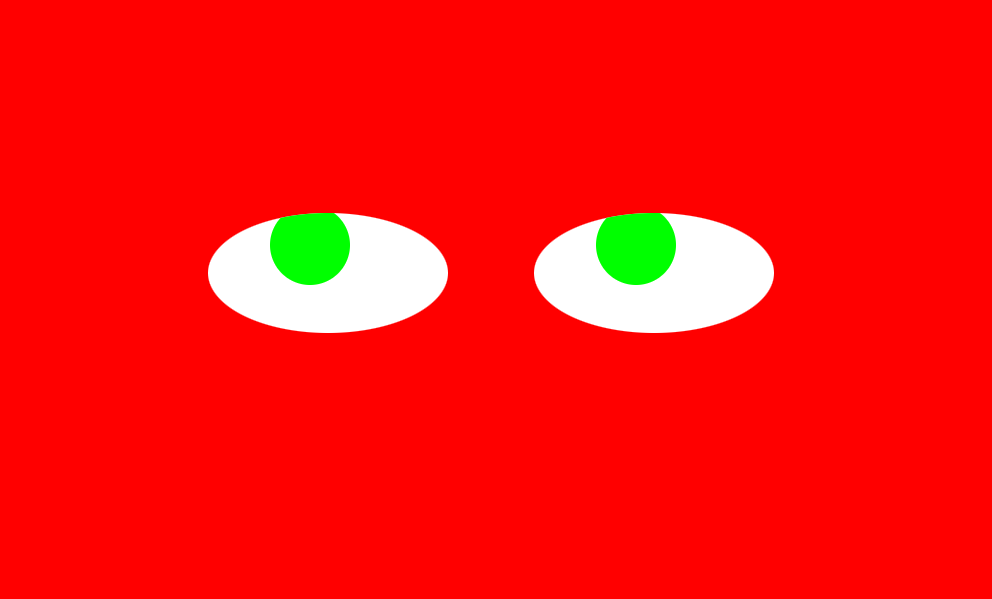

# Chasing Eyes

## Project Overview

Chasing Eyes is an interactive web page where the two eyes on the page tracks the user's mouse movement. The user can also change the background as well as eyes colors with a mouse click.

## How to Run

Simply open the index.html file in any browser to play the game. Interact with the page by moving the mouse and clicking.

## Scope of Funtionality & Improvements Roadmap

The application supports:

- Eyes tracking user mouse movement
- Background color switch on mouse click
- Eyes color switch on mouse click

Improvements Roadmap:

- Functionality to pause the eyes tracking the mouse movement

## Technologies Used

- Javascript: For providing animation and interactive functionalities
- HTML: For providing the page
- CSS: For providing style of the page

## License

[MIT License](LICENSE)
